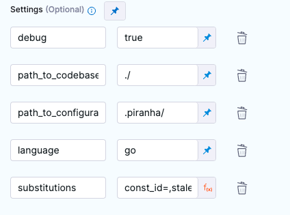

# Flag Cleanup

The Flag Cleanup plugin wraps the [uber/piranha](https://github.com/uber/piranha/blob/master/POLYGLOT_README.md#polyglot-piranha) feature flag cleanup tool.

## Build
Build the image with the following command:
```
make image
```

This will generate a local docker image named _harness/flag_cleanup:latest_ .

## Usage
Execute from the working directory of your codebase:
```shell
docker run -v ${CURDIR}:/my-codebase -e PLUGIN_DEBUG=true -e PLUGIN_PATH_TO_CODEBASE="/my-codebase" -e PLUGIN_PATH_TO_CONFIGURATIONS="/my-codebase/.flag_cleanup_config/" -e PLUGIN_LANGUAGE="go" -e PLUGIN_SUBSTITUTIONS="stale_flag_name=flag_to_remove,treated=true" harness/flag_cleanup:latest
```

## Parameters

| Name                         | Description                                                                                                                                                    | Default |
|------------------------------|----------------------------------------------------------------------------------------------------------------------------------------------------------------|---------|
| language (required)          | The target language [possible values: java, swift, py, kt, go, tsx, ts]                                                                                        |         |
| path_to_codebase             | Path to source code folder or file                                                                                                                             | ./      |
| path_to_configurations       | Directory containing the configuration files - rules.toml and edges.toml (optional)                                                                            | ./      |
| cleanup_comments             | Enables deletion of associated comments                                                                                                                        | true    |
| cleanup_comments_buffer      | The number of lines to consider for cleaning up the comments                                                                                                   | 2       |
| delete_file_if_empty         | User option that determines whether an empty file will be deleted                                                                                              | true    |
| delete_consecutive_new_lines | Replaces consecutive `\n`s  with a `\n`                                                                                                                        | true    |
| debug                        | Prints all output from piranha tool to console                                                                                                                 | true    |
| dry_run                      | Disables in-place rewriting of code                                                                                                                            | false   |
| substitutions                | These substitutions instantiate the initial set of rules. Usage (comma separated key=value pairs): stale_flag_name=my_flag,treated=true,other_rule=other_value |         |


## Running locally
When running the plugin docker image locally all parameters need to be upper camel cased and prefixed with PLUGIN_ which is convention with drone plugins e.g.
```shell
docker run -v ${CURDIR}:/my-codebase -e PLUGIN_DEBUG=true -e PLUGIN_PATH_TO_CODEBASE="/my-codebase" -e PLUGIN_PATH_TO_CONFIGURATIONS="/my-codebase/.flag_cleanup_config/" -e PLUGIN_LANGUAGE="go" -e PLUGIN_SUBSTITUTIONS="stale_flag_name=flag_to_remove,treated=true" harness/flag_cleanup:latest
```

To execute the tool against your own codebase your code should be mounted into the container as a volume as shown ^. This will allow the changes to be persisted locally when the container terminates.

## Running as drone plugin
When running as a drone plugin the parameters can be used as shown in the table above e.g.



## Examples
### Go SDK Example
1. View the [example file](/examples/go/example.go) and observe the if block using our feature flag ```harnessappdemodarkmode```
2. Run the flag cleanup plugin from the root folder of this repo

```docker run -v ${PWD}/examples/go:/go -e PLUGIN_DEBUG=true -e PLUGIN_PATH_TO_CODEBASE="/go" -e PLUGIN_PATH_TO_CONFIGURATIONS="/go/config" -e PLUGIN_LANGUAGE="go" -e PLUGIN_SUBSTITUTIONS="stale_flag_name=harnessappdemodarkmode,treated=true" harness/flag_cleanup:latest```

3. Observe that the `if else` block has been removed from the code and the flag is now treated as globally true.


### Java SDK Example
1. View the [example file](/examples/java/ExampleClass.java) and observe the if else block using our feature flag ```STALE_FLAG```
2. Run the flag cleanup plugin from this directory. This can be done by running the following docker container

```docker run -v ${PWD}/examples/java:/java -e PLUGIN_DEBUG=true -e PLUGIN_PATH_TO_CODEBASE="/java" -e PLUGIN_PATH_TO_CONFIGURATIONS="/java/config" -e PLUGIN_LANGUAGE="java" -e PLUGIN_SUBSTITUTIONS="stale_flag_name=STALE_FLAG,treated=true,treated_complement=false" harness/flag_cleanup:latest```

3. Observe that the `if else` block for `STALE_FLAG` has been removed from the code and the flag is now treated as globally true.
