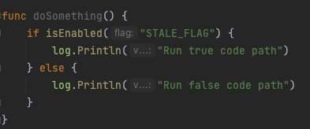
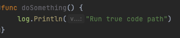

# Running Locally

## Purpose
This guide will allow you to run the flag cleanup tool locally using either the go or java sdk.

## Time Required
<5 minutes 

## Guide
A video demo of this is available in the [demo google drive folder](https://drive.google.com/drive/folders/1tbnnQ3dbed0bMpNFE58oOvOUM6cBLD62?usp=sharing)
For this example we will use the golang sdk example [here](../examples/go), however you can also use the java sdk example [here](../examples/java) if you'd prefer.

1. Fork this repository
2. Clone the forked repo locally

```
git clone git@github.com:${YOUR_USERNAME}/flag_cleanup.git
```
3. Look at the current code in the go sdk example file [here](../examples/go/example.go). Pay attention to the `if else` block that checks if the `STALE_FLAG` flag is enabled.



4. Run the code cleanup example from the root folder of this repo. This checks for the presence of the `STALE_FLAG` flag and if present treats any `isEnabled("STALE_FLAG")` checks as true.

```shell
docker run -v ${PWD}/examples/go:/go -e PLUGIN_DEBUG=true -e PLUGIN_PATH_TO_CODEBASE="/go" -e PLUGIN_PATH_TO_CONFIGURATIONS="/go/config" -e PLUGIN_LANGUAGE="go" -e PLUGIN_SUBSTITUTIONS="stale_flag_name=STALE_FLAG,treated=true" harness/flag_cleanup:latest
```

5. Observe the changes made to the example.go file - namely that the `if else` block has been removed and only the `true` code path remains. 



## Explanation
Firstly, for detailed information of how this tool works see the piranha [documentation](https://github.com/uber/piranha/blob/master/POLYGLOT_README.md).

### What do the plugin parameters do?
For information on which parameters are available to pass to the flag cleanup plugin see the main [readme](../README.md#parameters). 

These include options you might expect like the location to the base directory of the code you want to cleanup, location of your config (more on that later) and substitutions which for most cases will be the name of the flag you want to remove (`stale_flag_name`) and whether you want the flag to be considered globally true or false (`treated`).

### Where can I find more examples?
A suite of examples are maintained in the uber/piranha repository. These can be found in the [test cases](https://github.com/uber/piranha/tree/master/test-resources) folder as well as in the [demo](https://github.com/uber/piranha/tree/master/demo) sample folder. 

### What configuration files are required?
A valid rules.toml file is a requirement. For more advanced use cases an edges.toml file may also be required. Examples of their usage can be found at the links above. The rules.toml file will also be explained and analysed in the next article.

### What does a rule.toml file look like and how do I create one?
This will be covered in the next section about [understanding rules](./2_understanding_rules.md).
