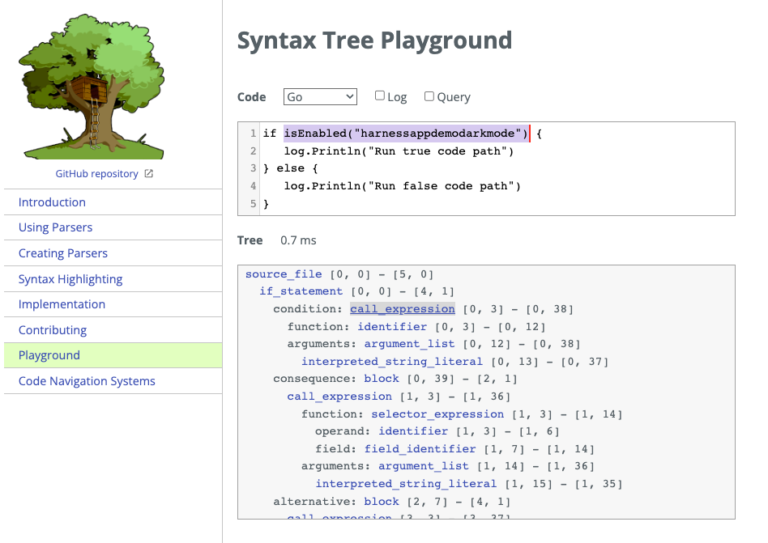
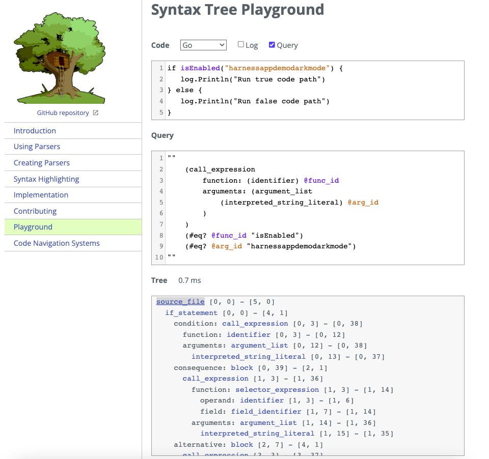

# Tree Sitter Playground Guide

### What is tree-sitter?
Tree-sitter is a parser generator tool which can build a concrete syntax tree for a source file. Basically it can take some source code and convert it to a syntax tree that can be queried so we can find matching nodes. This is useful because we can use these tree sitter queries to identify where we use feature flags in our codebase, and then automatically remove them and refactor the code. 

## Guide
This short guide aims to get you up and running using the tree sitter playground, which makes understanding the example queries much easier, and speeds up how quickly you can write queries for your own codebase.

This will use the [go sdk sample](../examples/go/example.go).

## Steps
A video demo of this is available in the [demo google drive folder](https://drive.google.com/drive/folders/1tbnnQ3dbed0bMpNFE58oOvOUM6cBLD62?usp=sharing)
The steps involved in using this playground are:
1. Go to the [tree-sitter playground](https://tree-sitter.github.io/tree-sitter/playground).
2. Select your language from the `code` dropdown, in our case go
3. Paste your code into the code box
4. View the generated tree-sitter syntax in the box below 
5. Highlight code in the code box to see the corresponding tree-sitter syntax highlights in the box below or vice versa. 



Pasting in our code we can see the generated tree-sitter syntax and start to observe why our example query is structured the way it is.


**Code**
```go
if isEnabled("STALE_FLAG") {
   log.Println("Run true code path")
} else {
   log.Println("Run false code path")
}
```

**Generated Tree**
```shell
if_statement [0, 0] - [4, 1]
    condition: call_expression [0, 3] - [0, 38]
      function: identifier [0, 3] - [0, 12]
      arguments: argument_list [0, 12] - [0, 38]
        interpreted_string_literal [0, 13] - [0, 37]
    consequence: block [0, 39] - [2, 1]
      call_expression [1, 3] - [1, 36]
        function: selector_expression [1, 3] - [1, 14]
          operand: identifier [1, 3] - [1, 6]
          field: field_identifier [1, 7] - [1, 14]
        arguments: argument_list [1, 14] - [1, 36]
          interpreted_string_literal [1, 15] - [1, 35]
    alternative: block [2, 7] - [4, 1]
      call_expression [3, 3] - [3, 37]
        function: selector_expression [3, 3] - [3, 14]
          operand: identifier [3, 3] - [3, 6]
          field: field_identifier [3, 7] - [3, 14]
        arguments: argument_list [3, 14] - [3, 37]
          interpreted_string_literal [3, 15] - [3, 36]
```

**Query**
```
(call_expression
        function: (identifier) @func_id
        arguments: (argument_list
            (interpreted_string_literal) @arg_id
        )
    )
    (#eq? @func_id "isEnabled")
    (#eq? @arg_id "\\"@stale_flag_name\\"")
```

In this example our query is searching for any instance of the function call 

```go
isEnabled("STALE_FLAG")
```

It does this by checking for any nodes within the generated tree that match the structure of our query. Our query also allows us to search for the exact name of our function/flag using runtime variables. 

``function: (identifier) @func_id``: matches any function with the name of @func_id
``arguments: (argument_list
(interpreted_string_literal) @arg_id
)``: matches when the argument for this function is a string literal matching @arg_id 

`(#eq? @func_id "isEnabled")`: Sets the value of func_id to the hardcoded string literal "isEnabled"

`(#eq? @arg_id "\\"@stale_flag_name\\"")`: Sets the value of arg_id to @stale_flag_name - which we pass in via the substitutions when running the tool.


## Testing Queries in Tree Sitter Playground
You can also use the playground to test out your query syntax and make sure it's valid and matching the correct nodes. 

This is done by clicking the query tickbox and pasting your query into the Query text box. Note you will need to remove the outer parentheses from your rules.toml query to see the syntax highlighting work in the playground. 



You can see in this example that our blue highlighted @func_id in the Query box now matches the blue highlighted "isEnabled" function in the code section, and similar for the orange @arg_id and STALE_FLAG. 

This query box will also highlight any invalid syntax you may have.